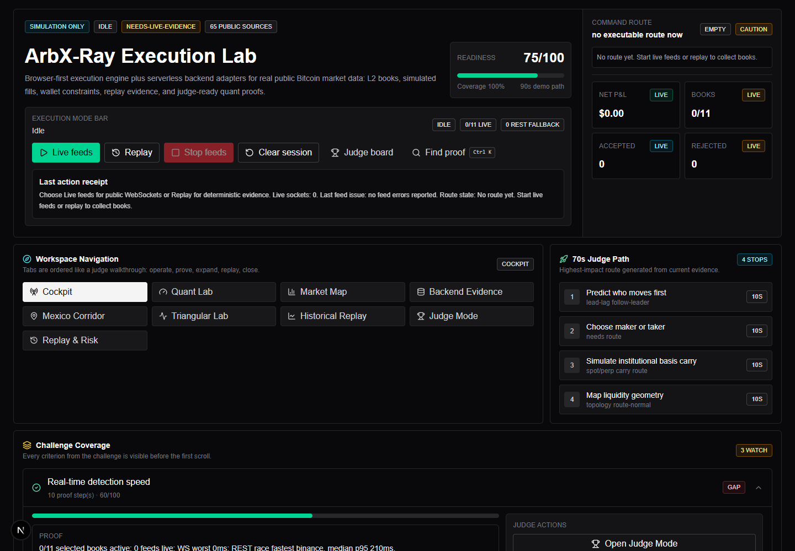
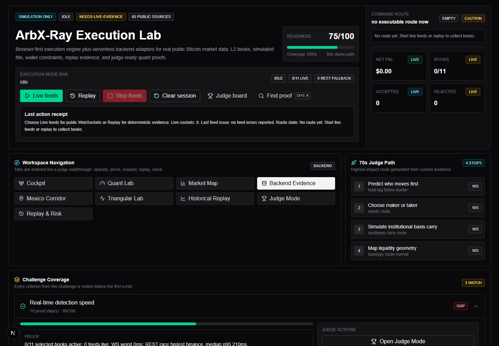
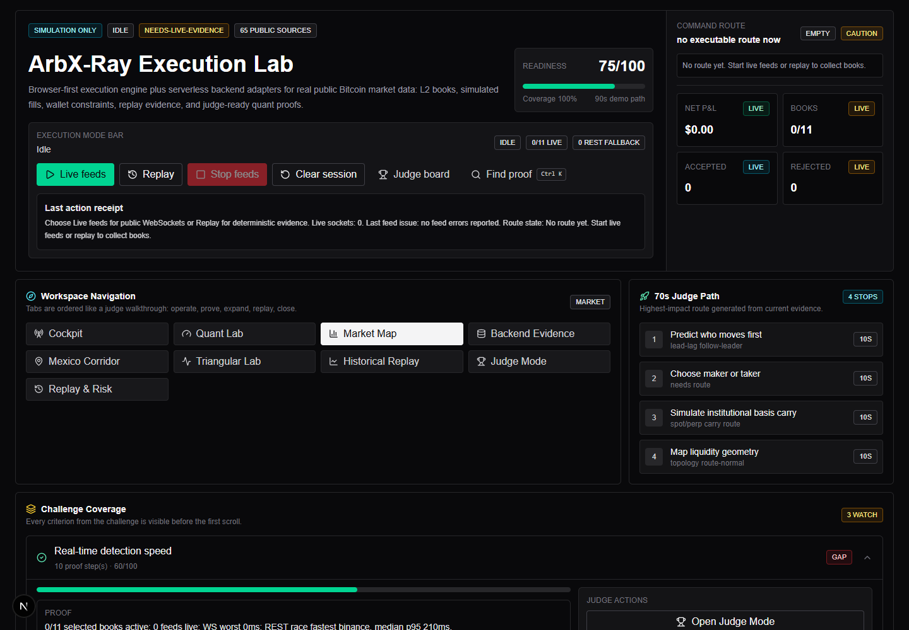
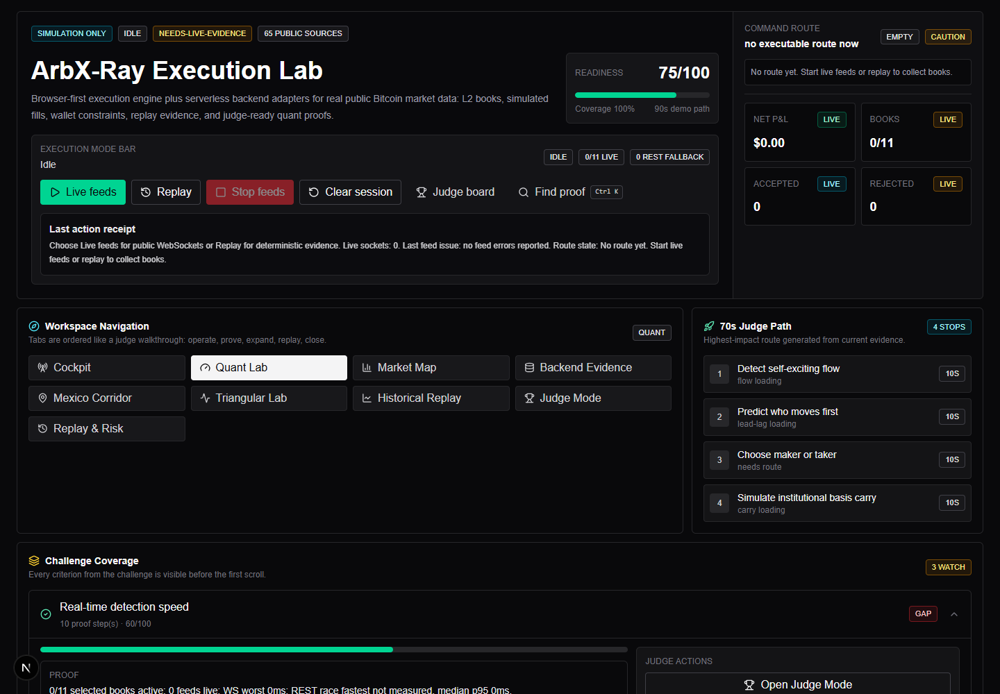
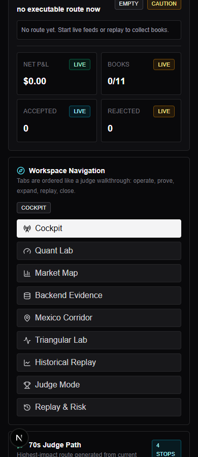

# ArbX-Ray

**ArbX-Ray** es un laboratorio full-stack de arbitraje Bitcoin con datos públicos reales. No coloca órdenes, no usa llaves privadas y no requiere tarjeta de crédito. La app reconstruye libros L2 de exchanges, cruza fuentes públicas y simula si un spread aparente puede ejecutarse después de profundidad, fees, slippage, latencia, inventario y riesgo de settlement.

El objetivo del proyecto es demostrar ejecución realista, no solo mostrar `best_bid - best_ask`.

## Capturas de pantalla

### Cockpit principal



### Evidencia backend full-stack



### Market Map y liquidez global



### Quant Lab



### Vista móvil



## Stack tecnológico

- **Framework:** Next.js 16, React 19, TypeScript
- **UI:** Tailwind CSS 4, componentes estilo shadcn/ui, lucide-react
- **Estado:** Zustand
- **Motor live:** Web Worker en navegador
- **Persistencia local:** IndexedDB con `idb`
- **Backend:** Next.js Route Handlers bajo `src/app/api`
- **Testing:** Vitest, TypeScript typecheck, Next production build
- **Deploy recomendado:** Vercel Hobby
- **Credenciales:** ninguna API key privada, ningún exchange account, ningún pago real

## Arquitectura

```text
Browser cockpit
  - Dashboard
  - Web Worker
  - IndexedDB journal
  - Live WebSockets públicos

Next.js serverless backend
  - /api/health
  - /api/backend-manifest
  - /api/price-consensus
  - /api/liquidity-radar
  - /api/usdt-basis
  - /api/settlement-risk
  - otros Route Handlers públicos

Public APIs
  - Exchange order books
  - Trade tapes
  - Status pages
  - mempool.space
  - CoinGecko
  - Bitso Mexico corridor
  - Deribit/OKX/BitMEX derivatives context
```

El frontend abre feeds live cuando el navegador lo permite. El backend funciona como BFF/serverless para snapshots, agregación pública, fallback CORS-resilient, manifiesto técnico y evidencia full-stack.

## Qué hace

- Conecta venues BTC/USD, BTC/USDT y México BTC/MXN sin mezclar lanes de forma ingenua.
- Normaliza feeds públicos a un formato común de order book.
- Simula arbitraje dirigido: comprar en el ask ejecutable más barato y vender en el bid ejecutable más alto.
- Camina niveles L2 para calcular VWAP, fill parcial, slippage y depth consumed.
- Resta fees, rebalance/withdrawal cost, haircut de latencia, basis USD/USDT e inventario.
- Mantiene wallets prefundadas simuladas por venue.
- Rechaza rutas con razones explícitas: stale book, liquidez insuficiente, inventario insuficiente, P&L negativo, latencia excesiva, lane risk o circuit breaker.
- Incluye replay determinístico para demos cuando el mercado live está quieto o un feed falla.
- Expone fórmulas legibles y auditables para los modelos quant.

## Diferenciadores técnicos

- **Execution realism:** no confía solo en top-of-book; camina profundidad y calcula net P&L.
- **Backend Evidence:** prueba que la entrega incluye frontend + backend con Route Handlers reales.
- **Venue Connection Lab:** muestra endpoint, canal, latencia, fallback, errores y estado por venue.
- **Quant Lab:** microprice, queue position, Hawkes flow, latency alpha, mirage detector, optimal stopping y lead-lag.
- **Market Map:** liquidez global, price consensus, USDT basis, smart order routing, reliability oracle y arbitrage graph.
- **Mexico Corridor:** cruza Bitso BTC/MXN, Bitso USD/MXN y Coinbase BTC/USD para contexto nacional.
- **Historical Replay:** backtest/replay con políticas, heatmap, walk-forward, conformal guard y tournament.

## Instalación

Requisitos:

- Node.js 20 o superior
- npm
- GitHub CLI `gh` solo para publicar el repo

```bash
npm install
npm run dev
```

Abre:

```text
http://localhost:3000
```

## Uso rápido para demo

1. Abre el cockpit.
2. Pulsa **Live feeds** para conectar WebSockets públicos y snapshots REST.
3. Revisa **Command route** para ver la oportunidad actual o la razón por la que no hay ruta ejecutable.
4. Usa **Replay** para cargar una ejecución determinística.
5. Abre **Backend Evidence** para mostrar `/api/health`, `/api/backend-manifest` y módulos serverless.
6. Abre **Market Map**, **Quant Lab**, **Mexico Corridor** e **Historical Replay** como prueba técnica para jueces.
7. Usa **Stop feeds** para cerrar sockets y conservar evidencia visible.
8. Usa **Clear session** solo cuando quieras limpiar books, trades, wallets y journal visible.

## Endpoints backend principales

```text
GET /api/health
GET /api/backend-manifest
GET /api/price-consensus
GET /api/usdt-basis
GET /api/liquidity-radar
GET /api/market-context
GET /api/trade-tape
GET /api/venue-latency
GET /api/venue-reliability
GET /api/settlement-risk
GET /api/mexico-corridor
GET /api/triangular-lab
GET /api/historical-replay
```

Todos usan fuentes públicas. Los endpoints dinámicos usan `Cache-Control: no-store` y no reciben URLs arbitrarias del usuario.

## Seguridad y límites

- Simulation only.
- No trading real.
- No private API keys.
- No custody.
- No wallets reales.
- No secrets en el repo.
- No URLs públicas controladas por input del usuario.
- Los proxies serverless usan allowlists hardcodeadas por módulo.

## Scripts

```bash
npm run dev        # desarrollo local
npm run typecheck  # TypeScript sin emitir archivos
npm test           # suite Vitest
npm run build      # build de producción Next.js
npm audit --omit=dev
```

## Verificación recomendada antes de entregar

```bash
npm run typecheck
npm test
npm run build
npm audit --omit=dev
```

Prueba manual:

```text
http://localhost:3000/api/health
http://localhost:3000/api/backend-manifest
http://localhost:3000/api/price-consensus
http://localhost:3000/api/usdt-basis
http://localhost:3000/api/liquidity-radar
```

## Publicación en GitHub

El repo está preparado para publicarse como proyecto público:

```bash
gh repo create arbx-ray --public --source=. --remote=origin --push
```

Si el nombre `arbx-ray` ya existe en tu cuenta, el comando fallará. En ese caso conviene elegir un nombre explícito como `arbx-ray-challenge` antes de volver a intentar.

## Deploy

Deploy recomendado:

- Vercel Hobby
- Framework preset: Next.js
- Build command: `npm run build`
- Output: configuración estándar de Next.js

No se requiere Railway, Render, base de datos ni worker always-on para la demo.

## Referencias públicas usadas

- Kraken, Coinbase, Gemini, Binance, Bybit, Gate.io, OKX, Bitfinex, Bitstamp, KuCoin y Bitget para market data.
- Bitso para BTC/MXN y USD/MXN.
- mempool.space para fees y projected blocks.
- CoinGecko para precios, tickers y contexto de mercado.
- Alternative.me para Fear & Greed.
- Deribit, OKX y BitMEX para presión de derivados/opciones.

## Estado del proyecto

ArbX-Ray está diseñado como una entrega de challenge defendible: frontend interactivo, backend serverless verificable, datos públicos reales, simulación sin riesgo custodial y explicabilidad matemática para cada decisión.
